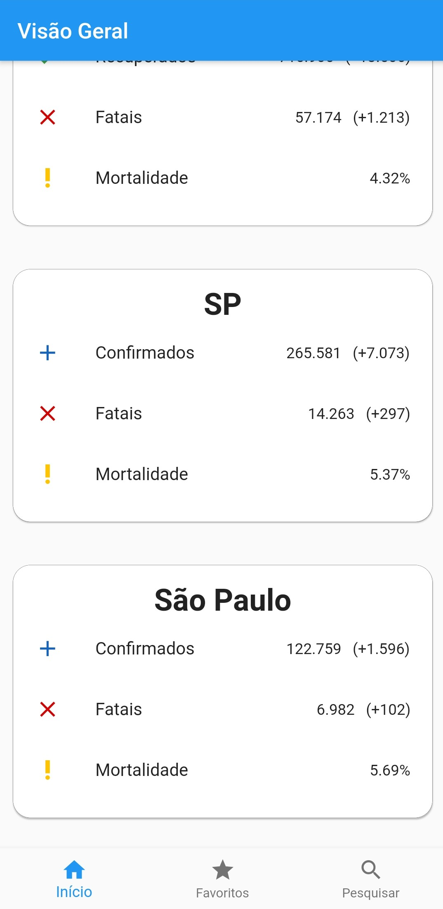

# COVID Nearby

> Visualizador da situação do COVID-19 nos estados e cidades do Brasil.

## Objetivo

O aplicativo COVID Nearby é inspirado na iniciativa do buscador [Bing](https://bing.com) com o [COVID-19 Tracker](https://bing.com/covid/) e tem por objetivo mostrar ao usuário, baseado em sua localidade, os casos de COVID-19 nas proximidades, seja na sua cidade ou estado (o que for mais específico). Dessa forma, o aplicativo espera facilitar a procura dos usuários pelos casos da doença em suas regiões, bem como informar e concientizar os mesmos da seriedade do vírus e da importância em se proteger e ficar em casa.

## APIs utilizadas

```json
[
  {
    "fonte": "https://brasil.io",
    "codigo_fonte": "https://github.com/turicas/covid19-br",
    "documentacao": [
      "https://brasil.io/dataset/covid19",
      "https://brasil.io/api/dataset/covid19",
      "https://github.com/turicas/covid19-br/blob/master/api.md"
    ]
  },
  {
    "fonte": "https://about-corona.net",
    "codigo_fonte": "https://en.wikipedia.org/wiki/HTTP_404",
    "documentacao": [
      "https://about-corona.net/documentation"
    ]
  }
]
```

## Roadmap do projeto

### Milestones - v1

  - Inicialização do App
    - Obter a localização atual do usuário, consultar a API selecionada para pegar o número de casos da mesma, e navegar à tela Principal com essas informações
  - Tela Principal
    - Visualização da localização atual do usuário ou da região selecionada
    - Disponibilizar um mecanismo de busca de outras regiões pelo usuário
    - Disponibilizar a opção de favoritar regiões de interesse do usuário
  - Tela Favoritos
    - Visualização das regiões favoritadas
    - Caso alguma região seja selecionada, consultar a API selecionada para pegar o número de casos da mesma, e retornar à tela Principal com essas informações
    - Caso alguma região seja selecionada, permitir que o usuário delete uma região favoritada

### Milestones - v2

  - Incluir na tela principal os números de casos ativos, recuperados e fatais do Brasil e do mundo
  - Incluir na tela principal gráficos da evolução do número de casos
  - Incluir um mapa mostrando a localização atual do usuário ou a região selecionada

## Protótipo das telas do aplicativo

**Principal e Favoritos**


## Imagens das telas do aplicativo

**Principal**




**Favoritos**


**Busca**


**Detalhes**


